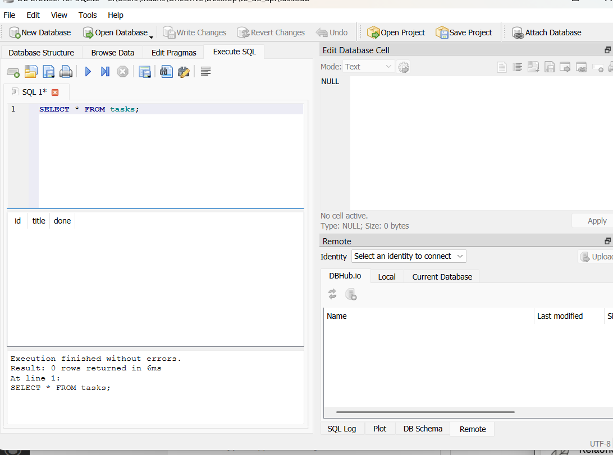

# Task API

A CRUD (Create, Read, Update, Delete) API for managing a to-do list, built with FastAPI and backed by a SQLite database. Task data persists across server restarts.

## Why SQLite

SQLite was chosen because it requires no separate database server or installation — it stores the entire database in a single file (`tasks.db`) on disk, making it ideal for a small local project like this one. The database and table are created automatically the first time the app runs.

## Where the database is stored

The database lives in a single file, `tasks.db`, created automatically in the project's root folder the first time the app starts. It is excluded from Git via `.gitignore`, since each developer's local database file is their own.

## How to run it

```bash
git clone https://github.com/maansi4025-lgtm/todo_api.git
cd todo_api
python -m venv venv
venv\Scripts\activate
pip install fastapi uvicorn
uvicorn main:app --reload
```

On first run, `tasks.db` is created automatically, the `tasks` table is created if missing, and 3 example tasks are inserted only if the table is empty.

Visit `http://127.0.0.1:8000/docs` for interactive Swagger UI.
## Running Postgres (Stage 0)

```
docker run --name taskdb -e POSTGRES_PASSWORD=dev -e POSTGRES_DB=tasks -p 5432:5432 -v taskdata:/var/lib/postgresql/data -d postgres:17
```
## Endpoints

| Method | Path | Description |
|---|---|---|
| GET | `/` | API info |
| GET | `/health` | Health check |
| GET | `/tasks` | List all tasks |
| GET | `/tasks/{task_id}` | Get a single task |
| POST | `/tasks` | Create a new task |
| PUT | `/tasks/{task_id}` | Update a task |
| DELETE | `/tasks/{task_id}` | Delete a task |

## Proving persistence

Created a task via `POST /tasks`, then fully stopped the server (`Ctrl+C`) and restarted it (`uvicorn main:app --reload`). Ran `GET /tasks` again — the created task was still present, confirming data survives a restart because it's written to `tasks.db` on disk rather than held in memory.

## Database viewer

Opened `tasks.db` in DB Browser for SQLite to run queries directly against the database:

```sql
SELECT * FROM tasks WHERE done = 1;
```



Confirmed that changes made directly in DB Browser (e.g. deleting all completed tasks) were immediately reflected by the running API — proving the API and the database file are one shared source of truth.

## Notes

Data is stored in SQLite (`tasks.db`) instead of memory, so it now survives server restarts — this is the fix for the "mortality" limitation observed in the previous in-memory version of this project.