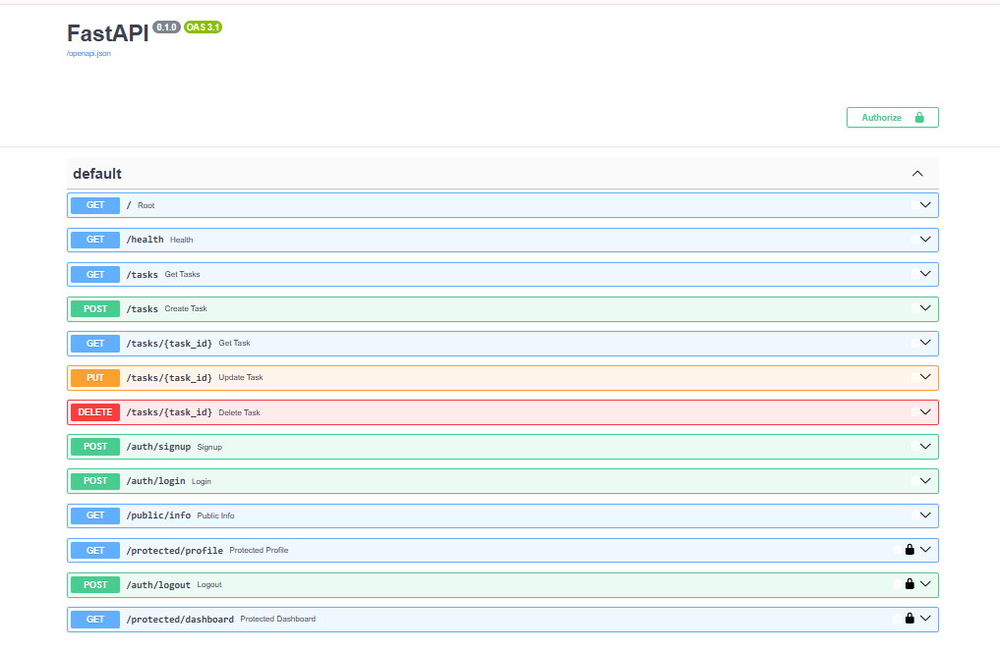

# Task API

A CRUD (Create, Read, Update, Delete) API for managing a to-do list, built with FastAPI, PostgreSQL, and Supabase Auth for user authentication. Fully containerized with Docker.

## How to run it

```bash
git clone https://github.com/maansi4025-lgtm/todo_api.git
cd todo_api
cp .env.example .env
```

Edit `.env` and fill in your own Supabase project URL and anon key (from your Supabase dashboard → Project Settings → API), then:

```bash
docker compose up
```

Visit `http://127.0.0.1:8000/docs` for interactive Swagger UI.

## Environment variables

See `.env.example`:

```
DATABASE_URL=postgres://postgres:dev@db:5432/tasks
SUPABASE_URL=your_supabase_project_url
SUPABASE_KEY=your_supabase_anon_key
PORT=8000
```

## Endpoints

| Method | Path | Auth required | Description |
|---|---|---|---|
| GET | `/` | No | API info |
| GET | `/health` | No | Health check |
| GET | `/public/info` | No | Public welcome message |
| POST | `/auth/signup` | No | Create a new user account |
| POST | `/auth/login` | No | Log in, returns access + refresh tokens |
| POST | `/auth/logout` | Yes | End the current session |
| GET | `/protected/profile` | Yes | Get the logged-in user's profile |
| GET | `/protected/dashboard` | Yes | Example second protected route |
| GET | `/tasks` | No | List all tasks |
| GET | `/tasks/{task_id}` | No | Get a single task |
| POST | `/tasks` | No | Create a new task |
| PUT | `/tasks/{task_id}` | No | Update a task |
| DELETE | `/tasks/{task_id}` | No | Delete a task |

## Example: signup → login → protected call

```
curl.exe --% -i -X POST http://127.0.0.1:8000/auth/signup -H "Content-Type: application/json" -d "{\"email\":\"user@example.com\",\"password\":\"yourpassword\"}"

HTTP/1.1 201 Created
{"user": {...}}
```

```
curl.exe --% -i -X POST http://127.0.0.1:8000/auth/login -H "Content-Type: application/json" -d "{\"email\":\"user@example.com\",\"password\":\"yourpassword\"}"

HTTP/1.1 200 OK
{"access_token": "eyJhbGc...", "refresh_token": "..."}
```

```
curl.exe --% -i http://127.0.0.1:8000/protected/profile -H "Authorization: Bearer eyJhbGc..."

HTTP/1.1 200 OK
{"id": "...", "email": "user@example.com", "created_at": "..."}
```

A tampered token on the same route returns:
```
HTTP/1.1 401 Unauthorized
{"error": "Invalid or expired token"}
```

## Swagger UI



## Notes

Authentication is handled entirely by Supabase Auth — this project never stores, hashes, or handles raw passwords itself. Token verification uses `supabase.auth.get_user(token)`, which makes a live network call to Supabase to confirm a token's signature is genuinely valid, not tampered with. A single reusable dependency (`get_current_user`) guards every protected route, demonstrated on two separate endpoints with zero duplicated authentication logic.