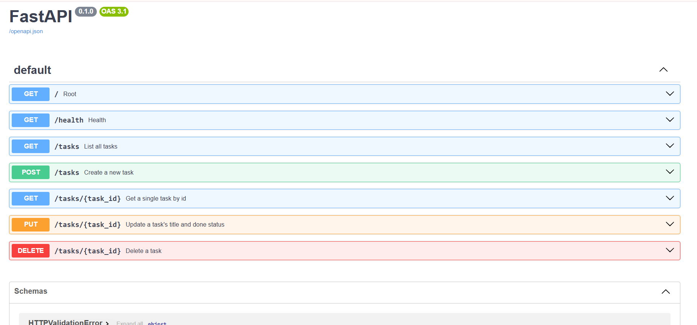

# Task API

A simple CRUD (Create, Read, Update, Delete) API for managing a to-do list, built with FastAPI. Task data is stored in memory and resets when the server restarts.

## How to run it

```bash
git clone https://github.com/maansi4025-lgtm/todo_api.git
cd todo_api
python -m venv venv
venv\Scripts\activate
pip install fastapi uvicorn
uvicorn main:app --reload
```

Then visit `http://127.0.0.1:8000` in your browser, or `http://127.0.0.1:8000/docs` for the interactive Swagger UI.

## Endpoints

| Method | Path | Description |
|---|---|---|
| GET | `/` | API info |
| GET | `/health` | Health check |
| GET | `/tasks` | List all tasks |
| GET | `/tasks/{task_id}` | Get a single task |
| POST | `/tasks` | Create a new task |
| PUT | `/tasks/{task_id}` | Update a task |
| DELETE | `/tasks/{task_id}` | Delete a task |

## Example request

curl.exe --% -i -X POST http://127.0.0.1:8000/tasks -H "Content-Type: application/json" -d "{\"title\":\"Buy milk\"}"
HTTP/1.1 201 Created
date: Wed, 15 Jul 2026 10:35:56 GMT
server: uvicorn
content-length: 40
content-type: application/json

{"id":5,"title":"Buy milk","done":false}

## Swagger UI



## Notes

Task data is stored in memory (a Python list), so it resets every time the server restarts — there's no database yet.