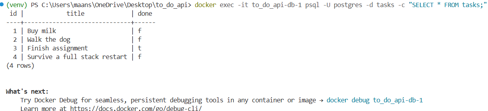

# Task API

A CRUD (Create, Read, Update, Delete) API for managing a to-do list, built with FastAPI and PostgreSQL, fully containerized with Docker. The entire stack — app and database — starts with a single command.

## How to run it

```bash
git clone https://github.com/maansi4025-lgtm/todo_api.git
cd todo_api
cp .env.example .env
docker compose up
```

Visit `http://127.0.0.1:8000/docs` for interactive Swagger UI.

On first run, the `tasks` table is created automatically, and 3 example tasks are inserted only if the table is empty.

## Environment variables

See `.env.example` for the required variables. Copy it to `.env` before running:

```
DATABASE_URL=postgres://postgres:dev@db:5432/tasks
```

`.env` is git-ignored — never commit real secrets.

## Endpoints

| Method | Path | Description |
|---|---|---|
| GET | `/` | API info |
| GET | `/health` | Health check |
| GET | `/tasks` | List all tasks |
| GET | `/tasks/{task_id}` | Get a single task |
| POST | `/tasks` | Create a new task |
| PUT | `/tasks/{task_id}` | Update a task |
| DELETE | `/tasks/{task_id}` | Delete a task |

## Example request

```
curl.exe --% -i -X POST http://127.0.0.1:8000/tasks -H "Content-Type: application/json" -d "{\"title\":\"Buy oat milk\"}"

HTTP/1.1 201 Created
content-type: application/json

{"id":4,"title":"Buy oat milk","done":false}
```

## Proving persistence

Created a task via `POST /tasks`, then ran `docker compose down` followed by `docker compose up` — a full teardown and rebuild of both the app and database containers. Ran `GET /tasks` again — the created task was still present, confirming data survives a full stack restart because it's written to a Docker volume, not the container's own disposable filesystem.

## Database screenshot

```
docker exec -it to_do_api-db-1 psql -U postgres -d tasks -c "SELECT * FROM tasks;"
```



## Architecture note

This project has now stored its data three different ways — an in-memory list, a SQLite file, and now PostgreSQL running in Docker — with the API's routes barely changing across all three. Only the storage layer (the functions that talk to the database) changed each time. This demonstrates that persistence is an implementation detail behind the API, not a property of the API itself.

## Notes

Data is stored in PostgreSQL, running in its own Docker container with a named volume (`taskdata`), so it now survives not just app restarts but full container teardowns — the most durable of the three storage approaches this project has used.